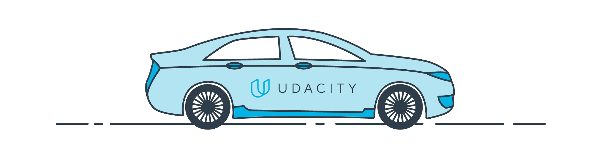
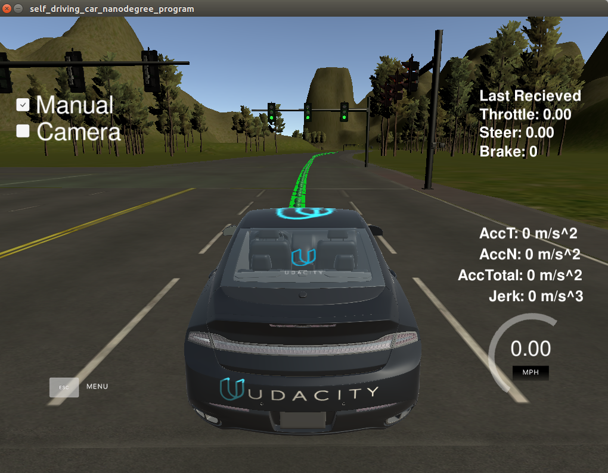
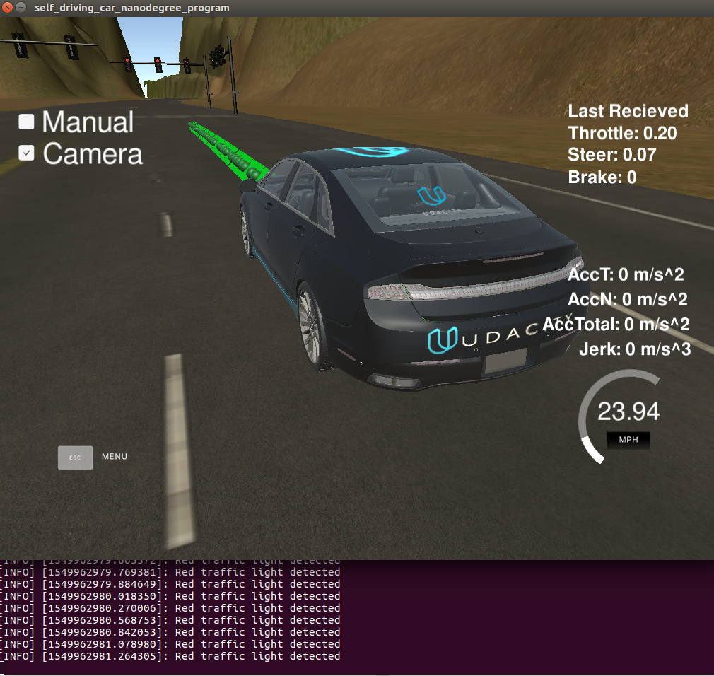
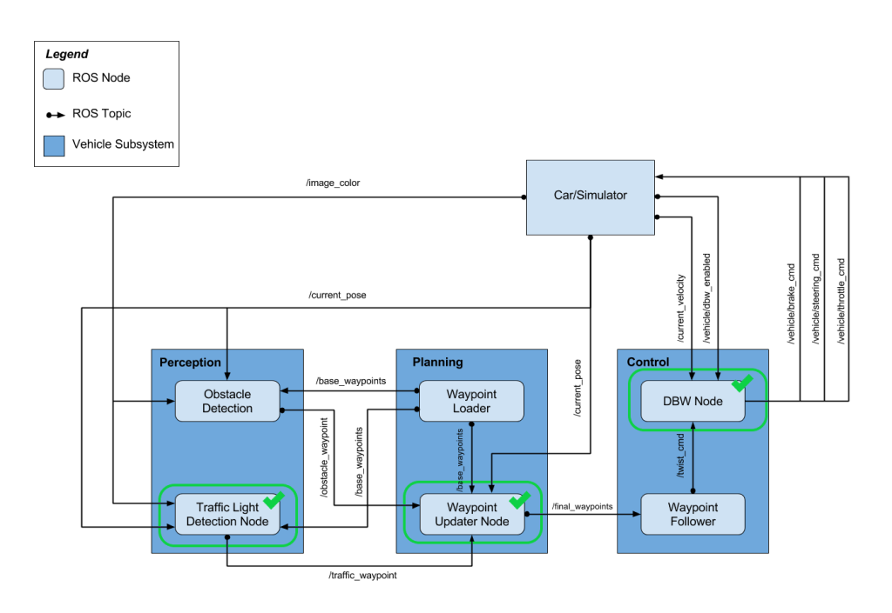

# Carla Autonoumus Vehicle Project



This is the last project of the self-driving car Engineering nano-degree by Udacity.

The goals of this project:
  - Stay in the lane following waypoints received from the simulator
  - Stop at red traffic lights





# System architecture




## Running the Project

1. Clone the repo
2. Install python dependencies
    ```bash
    pip install -r requirements.txt
    ```
3. Update profile.temp in ros/src/styx with the simulator full path
4. Make and run
    ```bash
    cd ros
    catkin_make
    source devel/setup.sh
    roslaunch launch/styx.launch
    ```

